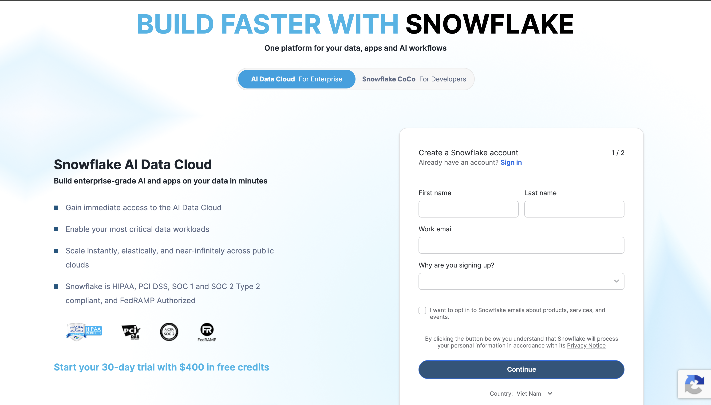

# 00 — Setup (authentication)

Do this once. Later lessons assume `TERRAFORM_SVC` can open a session.

This folder is not a Terraform object lesson. It is the chicken-and-egg step: Snowflake must already have a user before Terraform can log in as that user.


## What you will dos

1. Sign up for a trial (or use any account where you have `ACCOUNTADMIN`).
2. Generate a local RSA key pair.
3. Run `initial_setup.sql` in Snowsight.
4. Copy your organization name and account name into `terraform.tfvars`.


## Snowsight

Snowsight is Snowflake's web UI at [app.snowflake.com](https://app.snowflake.com). You use it to:

- sign up / sign in
- run this SQL
- look at objects Terraform creates later

Terraform talks to the same account through the API. It never opens Snowsight.



A trial is enough. Credits are real — keep warehouses suspended when you are not querying.


## Why a key pair, not your trial password

Trial human users almost always have MFA. Terraform cannot tap an authenticator app on every `plan`.

1. Generate a key pair locally.
2. Store the **public** key on a Snowflake user with `TYPE = SERVICE`.
3. Point the provider at the **private** key with `authenticator = "SNOWFLAKE_JWT"`.
4. Snowflake verifies the JWT and opens a session.

`.ssh/` is gitignored. Never commit the private key.


## Step 1 — Generate the key pair

From the repo root:

```bash
mkdir -p .ssh                                                    # Create the .ssh directory if it doesn't exist
openssl genrsa 2048 | openssl pkcs8 -topk8 -inform PEM -out .ssh/snowflake_tf_snow_key.p8 -nocrypt  # Generate a 2048-bit RSA private key and save as PKCS#8 .p8 file
openssl rsa -in .ssh/snowflake_tf_snow_key.p8 -pubout -out .ssh/snowflake_tf_snow_key.pub           # Extract the public key from the private key
chmod 600 .ssh/snowflake_tf_snow_key.p8                          # Restrict permissions on the private key for security
git check-ignore -v .ssh/snowflake_tf_snow_key.p8                # Confirm the private key is gitignored
```

# End of Selection

- `.p8` — private key, Terraform reads this
- `.pub` — public key, paste the body into `initial_setup.sql`


## Step 2 — Account identifiers

Snowflake needs **organization name** and **account name**.

From the Snowsight URL:

```text
https://app.snowflake.com/<organization_name>/<account_name>/...
```

Or run this in a worksheet as `ACCOUNTADMIN` (also in `initial_setup.sql`):

```sql
SELECT
    LOWER(CURRENT_ORGANIZATION_NAME()) AS organization_name,
    LOWER(CURRENT_ACCOUNT_NAME())      AS account_name;
```


## Step 3 — Create `TERRAFORM_SVC`

1. Open `initial_setup.sql`.
2. Paste the public key body (no `BEGIN` / `END` lines) over `<PASTE_PUBLIC_KEY_BODY_HERE>`.
3. Run the file in Snowsight as `ACCOUNTADMIN`.

Expected checks:

- `SHOW USERS LIKE 'TERRAFORM_SVC'` → `TYPE` is `SERVICE`, `HAS_RSA_PUBLIC_KEY` is true
- `DESC USER TERRAFORM_SVC` → `RSA_PUBLIC_KEY_FP` is set
- `SHOW GRANTS TO USER TERRAFORM_SVC` → `SYSADMIN` and `SECURITYADMIN`


## Step 4 — Local Terraform variables

From the repo root:

```bash
cp terraform.tfvars.example terraform.tfvars
```

Fill in `organization_name` and `account_name`. `terraform.tfvars` is gitignored.

Then:

```bash
terraform init
terraform plan
```

If the plan can reach Snowflake, authentication worked. Continue to [01 — Data](../01-data/README.md).


## Common mistakes

| Symptom | Likely cause |
| --- | --- |
| `failed to auth` / HTTP 404 | Wrong organization or account name |
| JWT / public key error | `BEGIN PUBLIC KEY` lines were pasted, or `.p8` does not match `.pub` |
| `HAS_RSA_PUBLIC_KEY` is false | `CREATE USER IF NOT EXISTS` skipped an old user. Run the `ALTER USER ... SET RSA_PUBLIC_KEY` line |
| MFA / password prompts | Provider is using your human user instead of `TERRAFORM_SVC` |


## Starting over

```sql
DROP USER IF EXISTS TERRAFORM_SVC;
```

Delete `.ssh/`, generate a new key pair, paste the new public key, run the SQL again.
