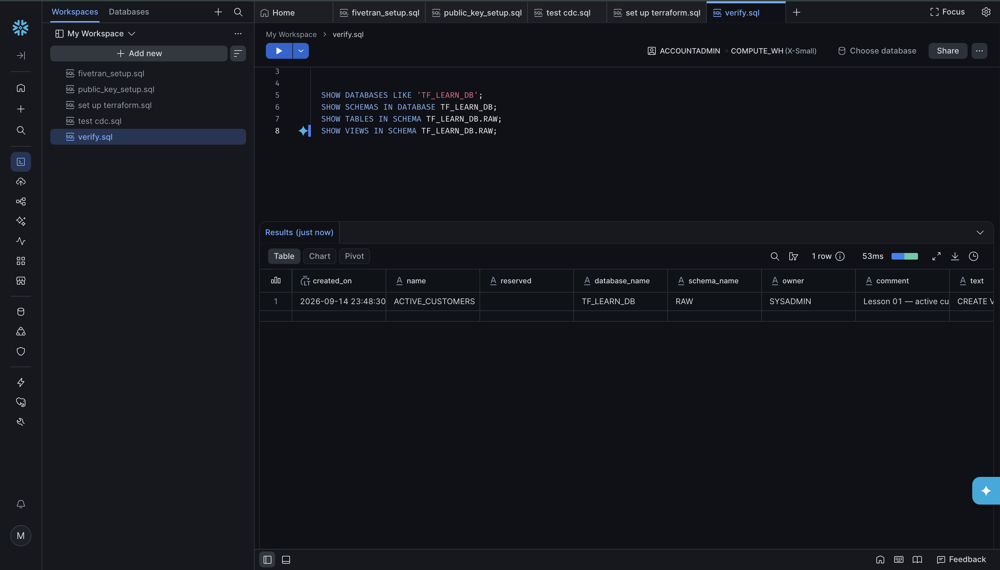

# 01 — Data

These are the objects you hit first in Snowflake. Each object is its own folder. Read them in nest order.

```text
01-data/
  database/     TF_LEARN_DB
  schema/       RAW
  table/        CUSTOMERS
  view/         ACTIVE_CUSTOMERS
  main.tf       wires the four together
```

```text
account
  └── database          TF_LEARN_DB
        └── schema      RAW
              ├── table CUSTOMERS
              └── view  ACTIVE_CUSTOMERS
```

A database is a container. A schema is a namespace inside it. A table holds rows. A view is a saved `SELECT` over those rows.

You do **not** need a custom warehouse to *create* these. You need a warehouse only to `INSERT` / `SELECT`. Trial accounts already have `COMPUTE_WH` — use that until lesson 02.


## Read in this order

1. [database](database/README.md)
2. [schema](schema/README.md)
3. [table](table/README.md)
4. [view](view/README.md)
5. `main.tf` in this folder — how the parent passes names downward


## Apply

From the **repo root** (not this folder):

```bash
terraform plan
terraform apply
```

Then in Snowsight: **Data** → **Databases** → `TF_LEARN_DB` → `RAW`. Or run `check.sql`.




## Next

[02 — Access](../02-access/README.md)
