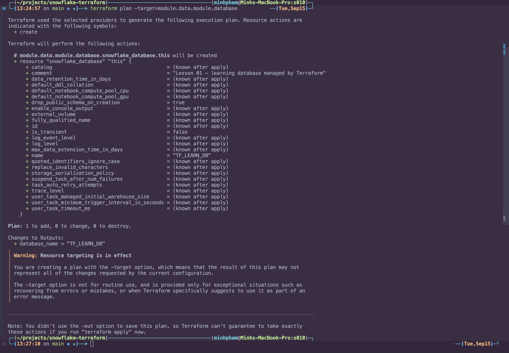
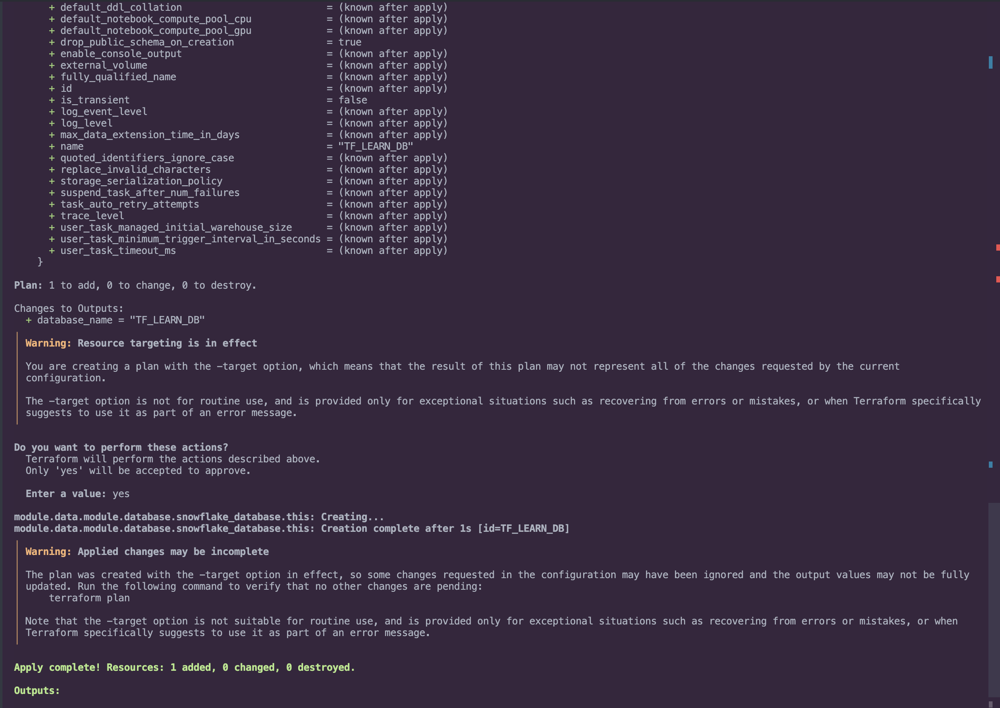

# Database

Container for schemas, tables, and views. `SYSADMIN` can create it.

```text
account → database TF_LEARN_DB   <-- this folder
```

The parent `01-data/main.tf` calls this folder with `source = "./database"`.


## `versions.tf`

```hcl
terraform {
  required_providers {
    snowflake = {
      source = "snowflakedb/snowflake"
    }
  }
}
```

Every module that contains a `resource "snowflake_..."` must name the provider. `source` tells Terraform to download `snowflakedb/snowflake` from the registry — not some other provider also called `snowflake`.

This file does **not** pin a version. The pin (`version = "~> 2.0"`) is only in the repo-root `versions.tf`. Child modules inherit that lock when you run `terraform init` at the root.

This file creates nothing in Snowflake.


## `main.tf`

```hcl
resource "snowflake_database" "this" {
  name         = "TF_LEARN_DB"
  comment      = "Lesson 01 — learning database managed by Terraform"
  is_transient = false
  drop_public_schema_on_creation = true
}
```

`resource "snowflake_database" "this"` is `type` + **local label**. `this` is not sent to Snowflake. Snowflake only sees `name = "TF_LEARN_DB"`. In state: `module.data.module.database.snowflake_database.this`. Every object folder uses `this` because it owns one resource.

| Argument | Meaning |
| --- | --- |
| `name` | Snowflake identifier. Unique in the account. |
| `comment` | Metadata in Snowsight / `SHOW DATABASES`. |
| `is_transient` | `false` = permanent (Time Travel + Fail-safe). `true` = no Fail-safe, cheaper scratch data. Changing this usually **replaces** the database. |
| `drop_public_schema_on_creation` | Drops default `PUBLIC` at create time so only `RAW` shows up. Create-time only. |


## Snowsight SQL

Same object, typed in a worksheet as `SYSADMIN`:

```sql
USE ROLE SYSADMIN;

CREATE DATABASE TF_LEARN_DB
    COMMENT = 'Lesson 01 — learning database managed by Terraform';

DROP SCHEMA IF EXISTS TF_LEARN_DB.PUBLIC;
```

`is_transient = false` is the default, so there is no `TRANSIENT` keyword. A transient database would be `CREATE TRANSIENT DATABASE ...`.


## `outputs.tf`

```hcl
output "name" {
  description = "Database name. Pass this into schema, table, view, grants, stages."
  value       = snowflake_database.this.name
}
```

An output exports a value to the caller (`01-data/main.tf`).

- `snowflake_database.this` — the resource in `main.tf`
- `.name` — the `name` argument → `"TF_LEARN_DB"`

| Output | Example | Use |
| --- | --- | --- |
| `name` | `TF_LEARN_DB` | `database_name = module.database.name` |

A database has no parent, so `fully_qualified_name` would be the same string. We only export `name`.

```hcl
module "schema" {
  source        = "./schema"
  database_name = module.database.name
}
```

Rename `TF_LEARN_DB` in `main.tf` and schema/table/view follow.


## Apply

From the **repo root** you can plan and apply just this object first:

```bash
terraform plan  -target=module.data.module.database
terraform apply -target=module.data.module.database
```

`plan` should show one add: `module.data.module.database.snowflake_database.this` → `TF_LEARN_DB`.



Approve `apply`. Creation is metadata — no warehouse credits.




## Creates

`snowflake_database.this` → `TF_LEARN_DB`

Next: [schema](../schema/README.md)
